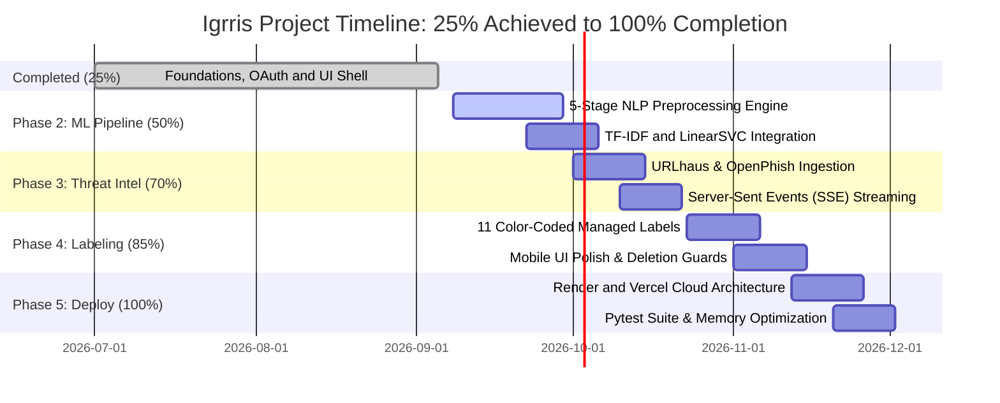

# ⚔️ IGRRIS: AI-Powered Gmail Intelligence & Threat Defense
# Project Progress & Technical Roadmap Report

**Document Reference:** IGRRIS-PR-2026-Q3-01  
**Current Milestone Status:** **25% COMPLETED | 75% REMAINING**  
**Reporting Period:** Phase 1 Completion & Phase 2–5 Planning  
**Target Delivery Date:** Q4 2026  
**Repository:** [Atharva-666/igrris](https://github.com/Atharva-666/igrris)  
**Lead Architecture:** Full-Stack AI & Cybersecurity (FastAPI, Nuxt 3, Scikit-Learn, Google Workspace API)

---

## Executive Summary

Email remains the #1 initial infection vector for cyberattacks. Traditional email security either relies on blunt spam filters that miss sophisticated spear-phishing or on enterprise appliances that are expensive and complex.

**Igrris** is an autonomous, full-stack inbox intelligence and threat defense system bridging the gap between high-speed threat intelligence, machine learning classification, and native Gmail workflow integration.

```
Overall Project Progress
[██████████░░░░░░░░░░░░░░░░░░░░░░░░░░░░░░] 25% Complete
├── Completed (25%): Architecture, Google OAuth 2.0, Nuxt 3 UI Shell, Basic Gmail API Connection
└── Remaining (75%): Machine Learning Pipeline, Threat Intelligence Feeds, SSE Streaming, Label Management, Cloud Deployments
```

This report documents:
1. **The 25% Completed Work:** The core infrastructure, Google OAuth session isolation, responsive Nuxt 3 interface, and basic Gmail integration.
2. **The 75% Remaining Roadmap:** A technical blueprint detailing the four upcoming phases—machine learning integration, real-time threat intelligence pre-filters, Server-Sent Events (SSE) streaming engines, and production cloud deployment.

---

## High-Level Progress Gauge

| Milestone Stage | Percentage | Focus Area | Status |
|---|:---:|---|:---:|
| **Milestone 1: Architectural Foundations** | **25%** | FastAPI Core, OAuth 2.0, Nuxt 3 UI Shell, Base Gmail Connection | **COMPLETED** |
| **Milestone 2: Machine Learning Pipeline** | **25%** | 5-Stage NLP Preprocessing, TF-IDF Vectorizer, LinearSVC Model | **PLANNED (Upcoming)** |
| **Milestone 3: Threat Intel & Streaming** | **20%** | URLhaus/OpenPhish Feeds, Pre-Filter Engine, SSE Streaming Engine | **PLANNED** |
| **Milestone 4: Automated Labeling & UX** | **15%** | 11 Color-Coded Labels, Deletion Guards, Mobile Slide-Over UI | **PLANNED** |
| **Milestone 5: Production Scale & Testing** | **15%** | Render/Vercel Cloud Deployments, Automated Test Suite, FOUC Fixes | **PLANNED** |
| **Total Project Scope** | **100%** | Comprehensive End-to-End Enterprise Inbox Security Platform | — |

---

# SECTION 1: The 25% Completed Work
*(Milestone 1: Architectural Foundations & Authentication MVP)*

### 1.1 Core System Architecture & Backend Framework
- **Asynchronous FastAPI Engine:** Built a modular Python 3.11+ backend utilizing FastAPI, Uvicorn, and Pydantic v2 for high-throughput request handling and strict data contract validation.
- **Micro-service Separation:** Codebase partitioned into distinct layers mapping to `auth`, `services`, `ai`, and `labels` to ensure scalability for the upcoming phases.

### 1.2 Enterprise-Grade OAuth 2.0 & Multi-User Session Isolation
- **Secure Authentication Flow:** Integrated Google OAuth 2.0 with confidential client credentials, automated refresh token handling, and clean session revocation.
- **Cryptographic Session Isolation:** Engineered `backend/auth/session.py` with an in-memory session manager issuing cryptographically signed `igrris_session` HTTP-only cookies.
- **Credential Segregation:** Eliminated global token risks by isolating each authenticated user's tokens into path-traversal-proof files (`credentials/<user_id>.json`).

### 1.3 Modern Reactive Frontend (Nuxt 3 / Vue 3)
- **Unified Single-Page Experience:** Merged hero landing and scan dashboard into `index.vue` with seamless authentication switching.
- **Visual Polish & Inspira UI:**
  - Brand identity: Custom `EncryptedText.vue` cyber cipher scramble header component and 6-stop high-contrast metallic typography.
  - Dark glassmorphic aesthetic with canvas background effects (`WavyBackground.vue`, `SplashScreen.vue`).

### 1.4 Basic Gmail API Integration
- **Native Gmail Integration:** Established direct interaction with the Google Workspace Gmail REST API using `google-api-python-client`.
- **Fetch Pipeline:** Engineered the foundational batching mechanisms needed to retrieve user inboxes safely, laying the groundwork for the upcoming scan engine.

---

### 1.5 Engineering Challenges Resolved in Phase 1

During the development of the initial 25% milestone, several complex architectural bugs and security vulnerabilities were resolved:

| Subsystem | Issue / Bug Encountered | Code Modification Applied |
|---|---|---|
| **Auth** | Multi-User Credential Collisions | Built `backend/auth/session.py` with isolated `credentials/<user_id>.json` and UUID traversal guards. |
| **OAuth** | CSRF State Loss Across Restarts | Configured `Flow.from_client_config(..., autogenerate_code_verifier=False)` in `oauth.py` to preserve state. |
| **Styling** | WebKit Text Gradient Disappearance | Replaced inline `text-shadow` with CSS `filter: drop-shadow(...)` to fix metallic text gradients in `EncryptedText.vue`. |
| **Build** | Vercel Automated Deploy `ERESOLVE` | Added `.npmrc` with `legacy-peer-deps=true` and enforced `overrides` in `package.json`. |

---

# SECTION 2: The 75% Remaining Work
*(The Forward Implementation Roadmap: Phases 2 through 5)*

The remaining 75% of the project transitions Igrris from a foundational skeleton into an **autonomous, machine-learning-powered inbox security platform**. This work is broken down into four strategic phases based on the actual components required for our final delivery.

---

## 2.1 Phase 2: Machine Learning & NLP Pipeline
**Milestone Progress:** 25% → 50% (+25%)  
**Primary Focus:** Integrating advanced Natural Language Processing and Classification models.

### A. 5-Stage NLP Preprocessing Pipeline
- **Text Normalization:** Lowercasing, Unicode sanitization, and Alphanumeric filtering.
- **Tokenization:** Sentence and word tokenization using NLTK `punkt`.
- **Lexical Generalization:** Context-preserving stopword removal and Porter Stemming.

### B. Vectorization & Classification Engine
- **Feature Extraction:** Implement TF-IDF vectorization with `max_features=3000`, sublinear TF scaling, and n-gram ranges.
- **Predictive Inference:** Train a `LinearSVC` classifier wrapped in `CalibratedClassifierCV` (sigmoid calibration) to compute continuous confidence probabilities (`predict_proba`).
- **Goal:** Achieve >95% overall accuracy and a high F1-score on standard spam/phishing corpora.

---

## 2.2 Phase 3: Threat Intelligence & Streaming Defense
**Milestone Progress:** 50% → 70% (+20%)  
**Primary Focus:** Pre-filtering known threats and streaming live results to the UI.

### A. Dual-Layer Threat Intelligence Pre-filter
- **Live Feed Ingestion:** Integrate active indicators from **URLhaus** and **OpenPhish**.
- **Atomic Updates & Caching:** Build an updater that separates `SEED_DATA_DIR` and `RUNTIME_DATA_DIR`, using atomic `.tmp` file replacements to prevent Git dirty states during live updates.
- **Deterministic Evaluation:** Intercept and flag malicious URLs via a Regex engine before they even reach the ML model.

### B. Real-Time Server-Sent Events (SSE) Streaming
- **Asynchronous Live Telemetry:** Replace sluggish REST polling with an active SSE pipeline (`GET /scan/stream`).
- **Cross-Origin Token Bridge:** Implement single-use, 60-second scan tokens (`POST /scan/token`) to bridge browser `EventSource` connections with strict cross-origin cookie policies.
- **Vue DOM Optimization:** Implement an SSE event batch queue flushing every 100ms to eliminate frontend reactivity thrashing during rapid scanning.

---

## 2.3 Phase 4: Automated Labeling & User Experience
**Milestone Progress:** 70% → 85% (+15%)  
**Primary Focus:** Automated organization within Gmail and frontend polish.

### A. 11-Category Taxonomy & Automated Action
- **Managed Labels:** Create 11 color-coded managed labels (🔴 Phishing, 🟥 Spam, 🔵 Security, 🟡 Needs Review, 🟢 Banking, 🟣 Orders, 🔷 Work, etc.).
- **Label Management API:** Add endpoints for safe label creation and deletion.
- **Label Safety Guards:** Implement strict logic in `backend/labels/manager.py` to explicitly block the accidental deletion of core system folders (`INBOX`, `SPAM`, `TRASH`).

### B. UI Polish & Mobile Responsiveness
- **Scan Stats Dashboard:** Develop a dynamic dashboard displaying threats neutralized and current progress.
- **Mobile Slide-Over Panel:** Implement a responsive slide-over email detail panel (`EmailDetails.vue`) and horizontal scroll containers for <430px viewports.
- **Eliminate FOUC:** Fix Flash of Unstyled Content by injecting early DOM blocking scripts into `nuxt.config.ts`.

---

## 2.4 Phase 5: Production Scale, Testing & Deployment
**Milestone Progress:** 85% → 100% (+15%)  
**Primary Focus:** Hardening for the cloud and comprehensive quality assurance.

### A. Production Cloud Deployments
- **Frontend Hosting:** Deploy the Nuxt 3 application on **Vercel** with automated GitHub CI/CD integration.
- **Backend Hosting:** Configure production blueprints for **Render** (`render.yaml`) and **Railway** (`railway.toml`).
- **Memory Optimization:** Pin Python versions, remove legacy heavy libraries (e.g., Streamlit), and pre-cache NLTK tokenizers during the build phase to stay under 512MB RAM free-tier limits.

### B. Automated Testing & Final QA
- **Test Suite:** Develop comprehensive unit and integration tests using `pytest` for the preprocessing, prediction, API, and labeling layers.
- **Final Packaging:** Ensure CORS preflight rules allow dynamically generated staging environments. Complete the final release candidate.

---

## Implementation Schedule & Milestones



---

## Conclusion

The first **25%** of the Igrris project has successfully established a fully integrated architectural skeleton, featuring secure Google OAuth 2.0 authentication, modular FastAPI backend design, and a modern Nuxt 3 user interface. 

The remaining **75%** of the roadmap outlines the critical integration of the actual intelligence layers—introducing the calibrated LinearSVC ML pipeline, real-time URLhaus threat feeds, high-performance SSE streaming telemetry, and robust Gmail auto-labeling mechanisms. By executing these planned phases and deploying to production cloud infrastructure, Igrris will achieve its goal of becoming a comprehensive, autonomous inbox defense platform.
