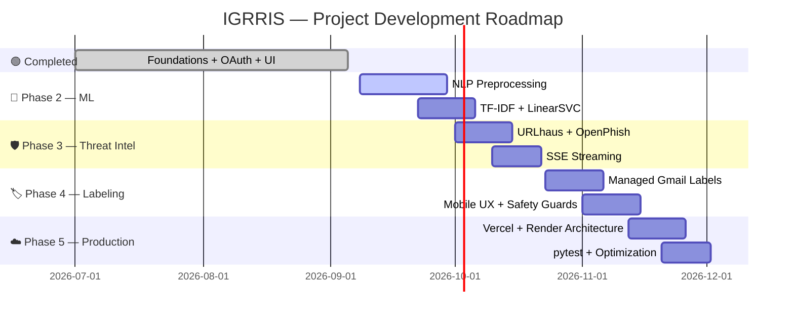

<div align="center">

# ⚔️ IGRRIS

### AI-Powered Gmail Intelligence & Threat Defense

**Autonomous Inbox Intelligence • Threat Detection • Gmail Security**

<br>

[](#-project-status)
[](#-roadmap)
[](#-technology-stack)
[](#-technology-stack)
[](#-technology-stack)
[](#-technology-stack)

<br>

> **🛡️ Intelligent Email · Real-Time Threat Detection · Automated Defense**

**25% COMPLETE**

`██████████░░░░░░░░░░░░░░░░░░░░░░░░░░░░░░░░`

**75% REMAINING → 100% TARGET**

<br>

[🚀 Repository](https://github.com/Atharva-666/igrris) •
[🤖 Machine Learning](#-phase-2-machine-learning--nlp) •
[🛡️ Threat Intelligence](#️-phase-3-threat-intelligence--streaming) •
[☁️ Deployment](#️-phase-5-production-testing--deployment)

</div>

---

# 🧭 Project Overview

**IGRRIS** is a full-stack AI-powered Gmail intelligence and threat-defense platform.

It combines:

- 🤖 Machine Learning
- 🧠 Natural Language Processing
- 🛡️ Threat Intelligence
- 📧 Gmail API
- 🔐 Google OAuth 2.0
- ⚡ Server-Sent Events
- 🏷️ Automated Gmail Labeling
- ☁️ Cloud Deployment

The goal is to transform a normal Gmail inbox into an **intelligent security layer** capable of detecting, classifying, monitoring, and organizing suspicious email activity.

---

# 📌 Project Information

| Property               | Details                                                     |
| :--------------------- | :---------------------------------------------------------- |
| **Document Reference** | `IGRRIS-PR-2026-Q3-01`                                      |
| **Current Status**     | 🟠 **25% Completed · 75% Remaining**                        |
| **Reporting Period**   | Phase 1 Completion & Phase 2–5 Planning                     |
| **Target Delivery**    | **Q4 2026**                                                 |
| **Architecture**       | Full-Stack AI & Cybersecurity                               |
| **Repository**         | [Atharva-666/igrris](https://github.com/Atharva-666/igrris) |

---

# 📊 Project Status

| Milestone                             |  Weight  |      Status      | Focus                               |
| :------------------------------------ | :------: | :--------------: | :---------------------------------- |
| 🏗️ **01 · Architectural Foundations** | **25%**  | 🟢 **COMPLETED** | FastAPI, OAuth 2.0, Nuxt 3, Gmail   |
| 🤖 **02 · Machine Learning Pipeline** | **25%**  |  🔵 **PLANNED**  | NLP, TF-IDF, LinearSVC              |
| 🛡️ **03 · Threat Intel & Streaming**  | **20%**  |  🔵 **PLANNED**  | URLhaus, OpenPhish, SSE             |
| 🏷️ **04 · Automated Labeling & UX**   | **15%**  |  🔵 **PLANNED**  | 11 labels, safety guards, mobile UI |
| ☁️ **05 · Production & Testing**      | **15%**  |  🔵 **PLANNED**  | Vercel, Render, Railway, pytest     |
| 🚀 **TOTAL PROJECT**                  | **100%** |  🎯 **TARGET**   | End-to-End Inbox Defense            |

---

# 🧠 How IGRRIS Works

```text
                         ┌─────────────────────┐
                         │       📧 GMAIL      │
                         └──────────┬──────────┘
                                    │
                                    ▼
                         ┌─────────────────────┐
                         │   🔎 INGESTION      │
                         │       LAYER         │
                         └──────────┬──────────┘
                                    │
                 ┌──────────────────┴──────────────────┐
                 │                                     │
                 ▼                                     ▼
       ┌─────────────────────┐              ┌─────────────────────┐
       │ 🛡️ THREAT INTEL     │              │ 🤖 AI / ML ENGINE   │
       │                     │              │                     │
       │ URLhaus             │              │ NLP                 │
       │ OpenPhish           │              │ TF-IDF              │
       │ URL Detection       │              │ LinearSVC            │
       └──────────┬──────────┘              └──────────┬──────────┘
                  │                                    │
                  └────────────────┬───────────────────┘
                                   ▼
                         ┌─────────────────────┐
                         │ ⚡ SCAN / DECISION  │
                         │       ENGINE        │
                         └──────────┬──────────┘
                                    │
                    ┌───────────────┼────────────────┐
                    ▼               ▼                ▼
             ┌────────────┐ ┌────────────┐ ┌──────────────┐
             │ 🏷️ LABELS  │ │ 📡 SSE     │ │ 📊 DASHBOARD │
             │            │ │ STREAMING  │ │              │
             └────────────┘ └────────────┘ └──────────────┘
```

---

# 🧰 Technology Stack

| Layer                      | Technologies                                   |
| :------------------------- | :--------------------------------------------- |
| 🎨 **Frontend**            | Nuxt 3 · Vue 3                                 |
| ⚙️ **Backend**             | Python 3.11+ · FastAPI · Uvicorn · Pydantic v2 |
| 🤖 **AI / ML**             | Scikit-Learn · NLTK · TF-IDF · LinearSVC       |
| 📧 **Email**               | Google Gmail REST API                          |
| 🔐 **Authentication**      | Google OAuth 2.0 · HTTP-only Sessions          |
| 🛡️ **Threat Intelligence** | URLhaus · OpenPhish                            |
| ⚡ **Realtime**            | Server-Sent Events (SSE)                       |
| ☁️ **Deployment**          | Vercel · Render · Railway                      |
| 🧪 **Testing**             | pytest                                         |

---

# ✅ SECTION 01 — Completed Work

<details open>
<summary><strong>🏗️ 1.1 Core System Architecture & Backend Framework</strong></summary>

### ⚙️ FastAPI Engine

- Modular Python 3.11+ backend.
- FastAPI asynchronous request handling.
- Uvicorn application server.
- Pydantic v2 data validation.
- Architecture separated into scalable layers.

```text
backend/
├── auth/
├── services/
├── ai/
└── labels/
```

</details>

---

<details open>
<summary><strong>🔐 1.2 Enterprise OAuth 2.0 & Multi-User Session Isolation</strong></summary>

### Authentication

- Google OAuth 2.0 integration.
- Confidential client credentials.
- Automated refresh-token handling.
- Clean session revocation.
- Cryptographically signed `igrris_session` HTTP-only cookies.

### Credential Isolation

```text
credentials/
│
├── <user_id_1>.json
├── <user_id_2>.json
├── <user_id_3>.json
└── ...
```

Each authenticated user's credentials are isolated to prevent global token collisions.

</details>

---

<details open>
<summary><strong>🎨 1.3 Modern Reactive Frontend — Nuxt 3 / Vue 3</strong></summary>

### UI

- Unified landing page and scan dashboard.
- Seamless authentication switching.
- Cyber-themed visual identity.
- Dark glassmorphic aesthetic.
- Canvas background effects.

### Custom Components

```text
EncryptedText.vue
WavyBackground.vue
SplashScreen.vue
```

</details>

---

<details open>
<summary><strong>📧 1.4 Gmail API Integration</strong></summary>

### Current Capabilities

- Direct Google Workspace Gmail REST API interaction.
- `google-api-python-client`.
- Foundational inbox fetching.
- Batching mechanisms for safe retrieval.
- Architecture prepared for the scan engine.

</details>

---

# 🐛 Engineering Challenges Resolved

| Subsystem      | Issue                              | Resolution                                                    |
| :------------- | :--------------------------------- | :------------------------------------------------------------ |
| 🔐 **Auth**    | Multi-user credential collisions   | Isolated `credentials/<user_id>.json` + UUID traversal guards |
| 🔑 **OAuth**   | CSRF state loss across restarts    | OAuth flow configuration updated                              |
| 🎨 **Styling** | WebKit text-gradient disappearance | CSS `filter: drop-shadow(...)`                                |
| 🚀 **Build**   | Vercel `ERESOLVE`                  | `.npmrc` + package dependency overrides                       |

---

# 🚧 SECTION 02 — Remaining 75%

The remaining roadmap transitions IGRRIS from its foundational architecture into an **autonomous machine-learning-powered inbox security platform**.

---

# 🤖 PHASE 2 — Machine Learning & NLP

### `25% → 50%` · **+25%**

## 🧠 5-Stage NLP Pipeline

```text
📨 RAW EMAIL
     │
     ▼
┌──────────────────────┐
│ 🧹 Text Normalization │
└──────────┬───────────┘
           ▼
┌──────────────────────┐
│ 🔤 Tokenization       │
└──────────┬───────────┘
           ▼
┌──────────────────────┐
│ 🧽 Stopword Processing│
└──────────┬───────────┘
           ▼
┌──────────────────────┐
│ 🌱 Porter Stemming    │
└──────────┬───────────┘
           ▼
┌──────────────────────┐
│ 📊 TF-IDF             │
└──────────┬───────────┘
           ▼
┌──────────────────────┐
│ 🧠 LinearSVC          │
│ + Calibration         │
└──────────┬───────────┘
           ▼
      🎯 PREDICTION
```

### Planned Components

- Text normalization.
- Lowercasing.
- Unicode sanitization.
- Alphanumeric filtering.
- NLTK `punkt` tokenization.
- Context-preserving stopword removal.
- Porter stemming.
- TF-IDF vectorization.
- `max_features=3000`.
- Sublinear TF scaling.
- N-gram features.
- `LinearSVC`.
- `CalibratedClassifierCV` with sigmoid calibration.

### 🎯 Model Goal

> **Target: >95% overall accuracy with a strong F1-score on standard spam/phishing corpora.**

---

# 🛡️ PHASE 3 — Threat Intelligence & Streaming

### `50% → 70%` · **+20%**

## 🌐 Dual-Layer Threat Intelligence

```text
       URLhaus
          │
          │
       OpenPhish
          │
          ▼
┌──────────────────────┐
│ 🛡️ THREAT INTEL      │
│     PRE-FILTER       │
└──────────┬───────────┘
           │
           ▼
    🚨 KNOWN THREAT?
       │          │
      YES         NO
       │          │
       ▼          ▼
   🚫 FLAG     🤖 ML MODEL
                    │
                    ▼
               🎯 CLASSIFY
```

### Planned Features

- Active URLhaus feed ingestion.
- OpenPhish feed ingestion.
- Runtime threat data.
- `SEED_DATA_DIR` / `RUNTIME_DATA_DIR` separation.
- Atomic `.tmp` file replacement.
- Regex-based malicious URL interception before ML inference.

---

## ⚡ Real-Time SSE Streaming

```text
Frontend
   │
   │ POST /scan/token
   ▼
┌─────────────────┐
│ 60-Second Token │
└────────┬────────┘
         │
         ▼
GET /scan/stream
         │
         ▼
┌─────────────────┐
│   SSE ENGINE    │
└────────┬────────┘
         │
         ▼
     📡 Events
         │
         ▼
┌─────────────────┐
│ Vue Dashboard   │
└─────────────────┘
```

### Performance

SSE events will use a **100ms batching queue** to reduce frontend reactivity overhead during rapid scanning.

---

# 🏷️ PHASE 4 — Automated Labeling & UX

### `70% → 85%` · **+15%**

## 📂 11-Category Gmail Taxonomy

```text
📨 INCOMING EMAIL
       │
       ▼
   🔎 IGRRIS
    ANALYSIS
       │
       ├── 🔴 PHISHING
       ├── 🟥 SPAM
       ├── 🔵 SECURITY
       ├── 🟡 NEEDS REVIEW
       ├── 🟢 BANKING
       ├── 🟣 ORDERS
       ├── 🔷 WORK
       └── ... MORE CATEGORIES
```

### 🏷️ Automated Labeling

- 11 managed color-coded Gmail labels.
- Safe label creation APIs.
- Safe label deletion APIs.
- Automatic organization of classified email.

### 🔒 Label Safety Guards

Core Gmail system folders will be protected:

```text
🚫 INBOX
🚫 SPAM
🚫 TRASH
```

---

## 📱 UI / UX Improvements

- 📊 Dynamic scan statistics dashboard.
- 🚨 Threats-neutralized counter.
- 📧 Responsive email detail panel.
- 📱 Mobile slide-over interface.
- ↔️ Horizontal scrolling for `<430px` viewports.
- ⚡ FOUC prevention.
- Early DOM-blocking scripts in `nuxt.config.ts`.

---

# ☁️ PHASE 5 — Production, Testing & Deployment

### `85% → 100%` · **+15%**

## 🚀 Production Architecture

```text
                     ┌──────────────┐
                     │    GitHub    │
                     └──────┬───────┘
                            │
              ┌─────────────┴─────────────┐
              │                           │
              ▼                           ▼
      ┌───────────────┐           ┌───────────────┐
      │    Vercel     │           │ Render /       │
      │   Nuxt 3 UI   │           │ Railway API    │
      └───────┬───────┘           └───────┬───────┘
              │                           │
              └─────────────┬─────────────┘
                            ▼
                   ┌──────────────────┐
                   │  IGRRIS Backend  │
                   ├──────────────────┤
                   │ Gmail API        │
                   │ ML Engine        │
                   │ Threat Intel     │
                   │ SSE Engine       │
                   └──────────────────┘
```

### ☁️ Deployment Plan

| Component              | Platform  |
| :--------------------- | :-------- |
| 🎨 Frontend            | Vercel    |
| ⚙️ Backend             | Render    |
| 🔁 Alternative Backend | Railway   |
| 📦 Source Control      | GitHub    |
| 📧 Email               | Gmail API |

### 🧠 Resource Optimization

- Pin Python versions.
- Remove legacy heavy dependencies such as Streamlit.
- Pre-cache NLTK tokenizers.
- Optimize memory usage for free-tier constraints.
- Maintain production-ready cloud configurations.

---

# 🧪 Automated Testing & QA

```text
                  🧪 TEST SUITE
                       │
        ┌──────────────┼──────────────┐
        ▼              ▼              ▼
   🤖 Preprocessing  🎯 Prediction   ⚙️ API
        │              │              │
        └──────────────┼──────────────┘
                       ▼
                  🏷️ Labeling
                       │
                       ▼
                    ✅ QA
```

### Test Coverage

```text
pytest
├── preprocessing tests
├── prediction tests
├── API tests
└── labeling tests
```

Final QA will also cover CORS preflight behavior and production release packaging.

---

# 🗺️ Roadmap



---

# 📈 Milestone Evolution

```text
25%                  50%               70%              85%             100%
 │                     │                 │                │                │
 ▼                     ▼                 ▼                ▼                ▼

🏗️ FOUNDATION ───► 🤖 ML ─────────► 🛡️ THREAT ───► 🏷️ LABELS ───► ☁️ PROD
     │                  │                 │                │                │
   DONE                NEXT             PLANNED          PLANNED          TARGET
```

---

# 🎯 Final Objective

## Build an Autonomous Inbox Defense Layer

```text
📧 Gmail
   +
🧠 NLP
   +
🤖 Machine Learning
   +
🛡️ Threat Intelligence
   +
⚡ Real-Time Streaming
   +
🏷️ Automated Organization
   +
☁️ Cloud Infrastructure
   =
⚔️ INTELLIGENT INBOX DEFENSE
```

The final platform is intended to:

1. 🔎 Analyze incoming email.
2. 🤖 Classify suspicious messages using ML.
3. 🛡️ Correlate URLs with threat-intelligence feeds.
4. ⚡ Stream scan activity in real time.
5. 🏷️ Automatically organize Gmail messages.
6. 🔒 Protect critical Gmail system folders.
7. ☁️ Operate through production cloud infrastructure.

---

# 🏁 Project Completion Target

| Stage                        | Progress |    State    |
| :--------------------------- | :------: | :---------: |
| 🏗️ Architectural Foundations | **25%**  | 🟢 Complete |
| 🤖 Machine Learning          | **50%**  |   🔵 Next   |
| 🛡️ Threat Intelligence       | **70%**  | ⚪ Planned  |
| 🏷️ Automated Labeling        | **85%**  | ⚪ Planned  |
| ☁️ Production & QA           | **100%** |  🎯 Target  |

---

<div align="center">

# ⚔️ IGRRIS

### **From Inbox → Intelligence → Detection → Defense**

<br>

`25% COMPLETE` → `100% TARGET`

<br>

**FastAPI · Nuxt 3 · Vue 3 · Scikit-Learn · Gmail API · Google OAuth**

<br>

⭐ **AI-Powered Gmail Intelligence & Threat Defense**

</div>
