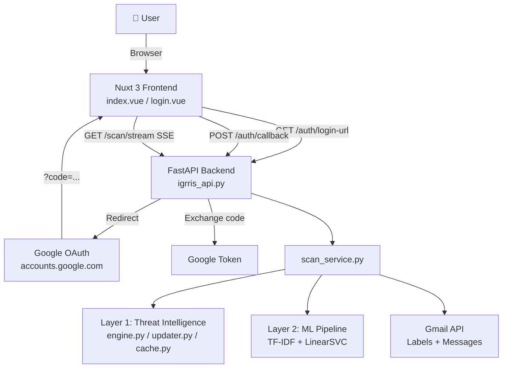
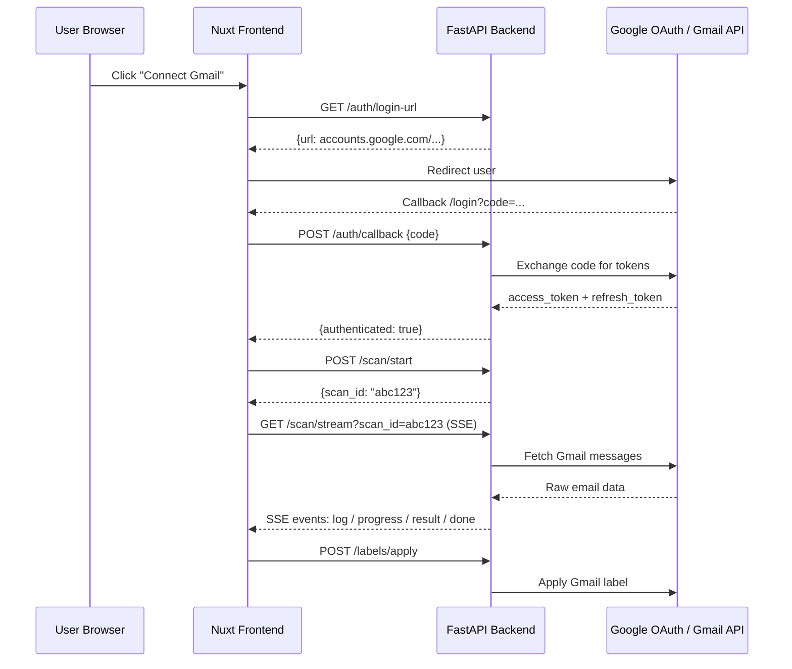
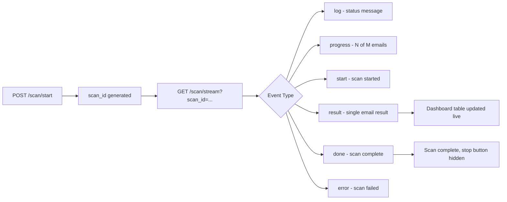

# ⚔️ Igrris — AI-Powered Gmail Intelligence

> **Igrris** is a production-ready, full-stack AI application that connects to your Gmail account via Google OAuth, scans your inbox in real time using a multi-layer threat intelligence + machine learning pipeline, and automatically labels every email into 11 intelligent categories — from Phishing and Spam to Banking, Orders, and Work.

[](https://www.python.org/)
[](https://fastapi.tiangolo.com/)
[](https://nuxt.com/)
[](https://scikit-learn.org/)
[](https://railway.app/)
[](https://vercel.com/)

---

## Table of Contents

1. [What is Igrris?](#what-is-igrris)
2. [Features](#features)
3. [System Architecture](#system-architecture)
4. [Project Structure](#project-structure)
5. [ML Pipeline](#ml-pipeline)
6. [Gmail Labels (11 Categories)](#gmail-labels-11-categories)
7. [API Reference](#api-reference)
8. [OAuth Flow](#oauth-flow)
9. [Getting Started](#getting-started)
10. [Configuration](#configuration)
11. [Running Locally](#running-locally)
12. [Testing](#testing)
13. [Cloud Deployment](#cloud-deployment)
14. [Tech Stack](#tech-stack)
15. [What We Built — Full Changelog](#what-we-built--full-changelog)

---

## What is Igrris?

**Igrris** (named after the Shadow Monarch's knight) is your Gmail guardian. It silently scans your inbox, identifies threats, and auto-tags every email so your inbox is always under control.

### How it works in 3 steps:

1. **Connect** — Click "Connect Gmail" and authorize via Google OAuth. Igrris never stores your emails.
2. **Scan** — A real-time SSE stream processes your emails through two layers: Threat Intelligence → Machine Learning.
3. **Label** — Every email gets a Gmail label (color-coded, visible in your Gmail sidebar immediately).

---

## Features

| Capability | Detail |
|---|---|
| 🔐 Google OAuth 2.0 | Secure login via Google. Tokens stored locally only, never on server. |
| 🛡️ Threat Intelligence | Pre-filter layer blocks known phishing URLs, blacklisted/disposable domains, and malicious IPs using live feeds. |
| 🧠 ML Classification | TF-IDF + LinearSVC classifies emails into 11 categories with confidence scores. |
| 📡 Real-time SSE Stream | Server-Sent Events stream live scan logs and results to the dashboard without polling. |
| 🏷️ Gmail Auto-Labeling | Creates and applies color-coded Gmail labels directly in your Gmail account. |
| 🗑️ Label Management | Delete individual or all Igrris-managed labels via the dashboard UI. |
| 🖥️ Premium Web UI | Nuxt 3 / Vue 3 frontend with glassmorphism, animated hero, falling stars, splash screen. |
| 📱 Fully Responsive | Mobile-first layout with touch-optimized controls down to 360px viewports. |
| ☁️ Cloud Deployed | Frontend on Vercel, Backend on Railway (production-grade). |
| ♿ Accessible | ARIA roles, `aria-label`, keyboard navigation, semantic HTML throughout. |
| 🎨 Igrris Brand Identity | Animated EncryptedText cipher header, metallic Igris typography, Shadow Monarch helmet logo. |

---

## System Architecture

### High-Level Overview



### OAuth & Scan Data Flow



### SSE Event Stream



---

## Project Structure

```
igrris/
│
├── 📂 backend/
│   ├── 📄 igrris_api.py              # FastAPI app — all routes (auth, scan, labels, health)
│   ├── 📄 config.py                  # All config: REDIRECT_URI, CORS, env vars
│   ├── 📂 auth/
│   │   └── 📄 oauth.py               # Google OAuth: get_auth_url, exchange_code, refresh, revoke
│   ├── 📂 services/
│   │   └── 📄 scan_service.py        # ML scanning logic — yields SSE events per email
│   ├── 📂 labels/
│   │   └── 📄 manager.py             # Gmail label CRUD: create, delete, delete_all
│   └── 📂 threat_intelligence/
│       ├── 📄 engine.py              # Rules evaluation engine
│       ├── 📄 updater.py             # Atomic live feed updater (URLhaus, OpenPhish)
│       └── 📄 cache.py               # In-memory fast URL/domain/IP cache
│
├── 📂 frontend-web/
│   └── 📂 app/
│       ├── 📂 pages/
│       │   ├── 📄 index.vue           # Unified landing page + scan dashboard
│       │   └── 📄 login.vue           # OAuth callback catcher (invisible redirect page)
│       ├── 📂 components/
│       │   ├── 📄 EncryptedText.vue   # Cyber cipher scramble animation for "Igrris" header brand
│       │   ├── 📄 WavyBackground.vue  # Interactive canvas hero background
│       │   ├── 📄 SplashScreen.vue    # Pitch-black intro splash with logo + falling stars
│       │   ├── 📄 FallingStarsBg.vue  # HTML5 canvas meteor/falling stars background
│       │   ├── 📄 EmailDetails.vue    # Slide-over panel for email metadata details
│       │   ├── 📄 ScanStats.vue       # Stats strip: counts per label category
│       │   ├── 📄 LabelBadge.vue      # Color-coded label chip component
│       │   ├── 📄 InteractiveHoverButton.vue # Premium hover-animated CTA button
│       │   └── 📄 ShimmerButton.vue   # Shimmer animated button
│       ├── 📂 composables/
│       │   ├── 📄 useApi.ts           # All API calls (scan, labels, auth)
│       │   ├── 📄 useAuth.ts          # Auth state management: login(), logout()
│       │   └── 📄 useMotionPresets.ts # Centralized spring animation presets
│       └── 📄 app.vue                 # Root app — SplashScreen, global dark mode
│
├── 📄 requirements.txt                # Python backend dependencies
├── 📄 railway.toml                    # Railway deployment config (Nixpacks + start command)
├── 📄 start.ps1                       # One-command local dev startup (backend + frontend)
├── 📄 .env                            # Local env vars (gitignored)
├── 📄 .env.example                    # Env var template for contributors
├── 📂 tests/
│   ├── 📄 test_labels.py              # Gmail label management unit tests
│   ├── 📄 test_preprocessing.py       # Text preprocessing edge cases
│   ├── 📄 test_predict.py             # ML prediction output validation
│   └── 📄 test_api.py                 # HTTP endpoint integration tests
├── 📂 old-code-files/                 # Legacy root-level scripts (archived, not in use)
└── 📖 README.md
```

---

## ML Pipeline

### Layer 1 — Threat Intelligence Pre-Filter

Before any email reaches the ML model, it is checked against:

| Check | Source |
|---|---|
| Known malicious URLs | URLhaus live feed |
| Phishing domains | OpenPhish live feed |
| Blacklisted domains | Local domain blacklist |
| Disposable email domains | Curated disposable domain list |
| Malicious IPs | IP reputation feeds |

If a high-confidence threat is detected, the email is immediately labeled **Phishing** and skipped by the ML layer.

### Layer 2 — Machine Learning

| Step | Detail |
|---|---|
| Vectorisation | TF-IDF, `max_features=3000` |
| Model | LinearSVC wrapped in `CalibratedClassifierCV` (for `predict_proba`) |
| Training Data | SMS Spam Collection + custom Gmail email corpus |
| Output | Category label + confidence score (0–1) |

### Text Preprocessing (shared training & inference)

| Step | Input | Output |
|---|---|---|
| 1. Lowercase | `"FREE Entry Win!"` | `"free entry win!"` |
| 2. Tokenise | `"free entry win!"` | `["free","entry","win","!"]` |
| 3. Keep alphanumeric | `["free","entry","win","!"]` | `["free","entry","win"]` |
| 4. Remove stopwords | `["free","in","win"]` | `["free","win"]` |
| 5. Porter Stemmer | `["winning"]` | `["win"]` |

### Model Performance

| Metric | Ham | Spam |
|---|---|---|
| Precision | 0.98 | 0.95 |
| Recall | 0.99 | 0.88 |
| F1 | 0.99 | **0.92** |

**Overall accuracy: 98%**

---

## Gmail Labels (11 Categories)

Igrris creates these labels in your Gmail with custom colors:

| Label | Color | Use Case |
|---|---|---|
| 🔴 Phishing | Dark Red | Credential harvesting, fake login pages |
| 🟥 Spam | Red | Bulk unsolicited mail |
| 🔵 Security | Blue | Security alerts, account notifications |
| 🟡 Needs Review | Amber | Low-confidence predictions |
| 🟢 Banking | Dark Green | Financial institutions |
| 🟣 Orders | Purple | Shopping receipts, order tracking |
| 🔷 Work | Navy | Professional correspondence |
| 🩵 Education | Cyan | Schools, courses, certifications |
| 🟠 Promotions | Orange | Marketing emails |
| ⬜ Personal | Gray | Emails from known contacts |
| ✅ Trusted | Green | Verified safe senders |

---

## API Reference

The FastAPI backend auto-generates interactive docs at **`http://localhost:8000/docs`**.

### Auth

| Method | Endpoint | Description |
|---|---|---|
| `GET` | `/auth/login-url` | Returns the Google OAuth authorization URL |
| `POST` | `/auth/callback` | Exchanges `code` for tokens, sets session |
| `POST` | `/auth/logout` | Revokes token, clears session |

### Scan

| Method | Endpoint | Description |
|---|---|---|
| `POST` | `/scan/start` | Starts a scan session, returns `scan_id` |
| `GET` | `/scan/stream?scan_id=` | SSE stream of scan events |
| `POST` | `/scan/stop/{scan_id}` | Stops an in-progress scan |

### Labels

| Method | Endpoint | Description |
|---|---|---|
| `GET` | `/labels` | Lists all Igrris-managed Gmail labels |
| `POST` | `/labels/delete` | Deletes specific managed label(s) |
| `DELETE` | `/labels/all` | Deletes all Igrris-managed labels |

### Health

| Method | Endpoint | Description |
|---|---|---|
| `GET` | `/health` | Health check — returns `{"status": "ok"}` |

### SSE Event Types (from `/scan/stream`)

```json
{ "type": "start",    "data": "Scan started. Processing 150 emails..." }
{ "type": "log",      "data": "Fetching batch 1 of 5..." }
{ "type": "progress", "data": { "current": 30, "total": 150 } }
{ "type": "result",   "data": { "subject": "...", "from": "...", "label": "Spam", "confidence": 0.97 } }
{ "type": "done",     "data": "Scan complete. 150 emails processed." }
{ "type": "error",    "data": "Authentication expired. Please reconnect." }
```

---

## OAuth Flow

> **Critical Rule**: The `REDIRECT_URI` in `backend/config.py` MUST exactly match what is registered in Google Cloud Console.

```
User clicks "Connect Gmail"
    │
    ▼
GET /auth/login-url  →  returns Google OAuth URL
    │
    ▼
Browser redirects to accounts.google.com
    │
    ▼
Google redirects to REDIRECT_URI (/login?code=...)
    │
    ▼
login.vue catches ?code= → POST /auth/callback
    │
    ▼
Backend exchanges code → access_token + refresh_token
    │
    ▼
User is authenticated → redirect to / (dashboard)
```

### URL Structure

| URL | Page | Purpose |
|---|---|---|
| `localhost:8501/` | `index.vue` | Unified Landing Page + Dashboard |
| `localhost:8501/login` | `login.vue` | OAuth callback catcher only |

---

## Getting Started

### Prerequisites

- **Python 3.11+**
- **Node.js 18+** and **npm**
- A **Google Cloud project** with OAuth 2.0 credentials and Gmail API enabled

### 1. Clone the Repository

```bash
git clone <your-repo-url>
cd igrris
```

### 2. Set Up Environment Variables

```bash
# Copy the root example (backend env vars)
cp .env.example .env

# Copy the frontend example
cp frontend-web/.env.example frontend-web/.env
```

Edit `.env` and fill in:

```env
GOOGLE_CLIENT_ID=your-client-id
GOOGLE_CLIENT_SECRET=your-client-secret
REDIRECT_URI=http://localhost:8501/login
ALLOWED_ORIGINS=http://localhost:8501
DEBUG=true
```

Edit `frontend-web/.env` and fill in:

```env
NUXT_PUBLIC_API_BASE=http://localhost:8000
NUXT_PUBLIC_GOOGLE_CLIENT_ID=your-client-id
```

### 3. Set Up Google Cloud Console

1. Go to [console.cloud.google.com](https://console.cloud.google.com)
2. Create a project → Enable **Gmail API**
3. Create **OAuth 2.0 Client ID** (Web Application)
4. Add Authorized Redirect URI: `http://localhost:8501/login`

### 4. Install Python Dependencies

```bash
python -m venv venv
venv\Scripts\activate          # Windows
# source venv/bin/activate     # macOS/Linux
pip install -r requirements.txt
```

### 5. Install Frontend Dependencies

```bash
cd frontend-web
npm install
cd ..
```

---

## Running Locally

### One-command startup (recommended)

```powershell
.\start.ps1
```

This starts:
1. **FastAPI backend** on port **8000** (background process)
2. **Nuxt frontend** on port **8501** (foreground — Ctrl+C stops both)

Open **[http://localhost:8501](http://localhost:8501)** in your browser.

### Manual startup

```powershell
# Terminal 1 — Backend
uvicorn backend.igrris_api:app --host 0.0.0.0 --port 8000 --reload

# Terminal 2 — Frontend
cd frontend-web
npm run dev -- --port 8501
```

---

## Testing

```bash
python -m pytest tests/ -v
```

| Test file | What it covers |
|---|---|
| `test_labels.py` | Gmail label creation, deletion, batch delete, system label protection |
| `test_preprocessing.py` | Empty strings, special chars, stopword removal, stemming, long text |
| `test_predict.py` | Prediction output format, spam/ham detection, confidence range, error handling |
| `test_api.py` | Health endpoint, valid prediction, empty/missing input, wrong HTTP method |

---

## Cloud Deployment

### Frontend — Vercel

1. Connect your GitHub repository to [Vercel](https://vercel.com)
2. Set Root Directory to `frontend-web`
3. Framework Preset: **Nuxt**
4. Set environment variables:
   - `NUXT_PUBLIC_API_BASE` = `https://your-api.up.railway.app`
   - `NUXT_PUBLIC_GOOGLE_CLIENT_ID` = your Google Client ID
5. Deploy!

### Backend — Railway

1. Connect your GitHub repository to [Railway](https://railway.app)
2. Railway auto-detects Python via `railway.toml`
3. Start Command (auto-configured): `uvicorn backend.igrris_api:app --host 0.0.0.0 --port $PORT`
4. Set environment variables:
   - `GOOGLE_CLIENT_ID`
   - `GOOGLE_CLIENT_SECRET`
   - `REDIRECT_URI` = `https://your-app.vercel.app/login`
   - `ALLOWED_ORIGINS` = `https://your-app.vercel.app`
5. Deploy!

> **Important**: After deploying, add `https://your-app.vercel.app/login` to **Authorized Redirect URIs** in Google Cloud Console.

---

## Tech Stack

| Layer | Technology | Version |
|---|---|---|
| Language | Python | 3.11+ |
| Backend Framework | FastAPI + Uvicorn | 0.110+ |
| Data Validation | Pydantic v2 | 2.0+ |
| ML Framework | scikit-learn | 1.3+ |
| NLP | NLTK | 3.8+ |
| Data | pandas, numpy | 2.0+, 1.24+ |
| Gmail Integration | google-auth, google-api-python-client | latest |
| Frontend Framework | Nuxt 3 / Vue 3 | 3.x |
| Styling | Tailwind CSS | 3.x |
| Animations | @vueuse/motion, @studio-freight/lenis | latest |
| Testing | pytest, httpx | 8.0+, 0.27+ |
| Backend Hosting | Railway | — |
| Frontend Hosting | Vercel | — |

---

## What We Built — Full Changelog

### Phase 1 — ML Core (Email/SMS Spam Classifier)
- Trained **LinearSVC + TF-IDF** model on SMS Spam Collection dataset (5,169 messages after dedup).
- Built `data_preprocessing.py` — 5-step NLP pipeline (lowercase → tokenise → filter → stopwords → stemmer).
- Compared 3 models: MultinomialNB, LogisticRegression, LinearSVC — auto-selected by F1 score.
- `CalibratedClassifierCV` wrapper for `predict_proba()` support.
- FastAPI REST service (`api.py`) with `/predict` and `/health` endpoints.
- Streamlit web UI (`app.py`) with confidence bar.
- 22 pytest tests: preprocessing, prediction, API.

### Phase 2 — Igrris Gmail Intelligence System
- Rebuilt the project as **Igrris** — full Gmail OAuth integration replacing the SMS-only demo.
- **Google OAuth 2.0** flow: `auth/oauth.py` — get URL, exchange code, refresh tokens, revoke.
- **Gmail API integration**: fetch messages, apply labels via `backend/labels/manager.py`.
- **Two-layer scanning**: Threat Intelligence pre-filter → ML classification.
- **11-category label system** with color-coded Gmail labels.
- **SSE streaming scan**: `GET /scan/stream` yields live events (log, progress, result, done, error).
- **Stop scan**: `POST /scan/stop/{scan_id}` cancels in-progress scans.
- `backend/config.py` — centralized config with env var support.

### Phase 3 — Premium Nuxt 3 Frontend
- Replaced Streamlit UI with **Nuxt 3 / Vue 3** frontend.
- `index.vue` — Unified landing page + scan dashboard (authenticated state reveals dashboard section).
- `login.vue` — Invisible OAuth callback catcher page.
- `useAuth.ts` — Reactive auth state management.
- `useApi.ts` — All API calls (scan start/stream/stop, labels, auth).
- `useMotionPresets.ts` — Centralized spring animation presets (fadeUp, scaleIn, hoverLift).
- `WavyBackground.vue` — Interactive HTML5 canvas hero background.
- `InteractiveHoverButton.vue`, `ShimmerButton.vue` — Premium animated buttons.
- `LabelBadge.vue`, `ScanStats.vue`, `EmailDetails.vue` — Result display components.

### Phase 4 — Brand Identity & Visual Polish
- **`EncryptedText.vue`** — Cyber cipher scramble animation decrypts to `"Igrris"` in the header navbar brand, with hover trigger and 3-second hold interval.
- **Metallic Igris Typography** — 6-stop high-contrast steel armor gradient, multi-layer `filter: drop-shadow` for dark bevel + red aura.
- **Shadow Monarch Helmet Logo** — Custom logo asset (`logo.png`) with transparent background in header.
- **`SplashScreen.vue`** — Pitch-black intro splash with centered glowing logo, scramble text, smooth fade-out, and `FallingStarsBg` canvas meteor animation.
- **Flash of Unstyled Content (FOUC) Fix** — Blocking inline script in `nuxt.config.ts` adds `dark` class before first paint, eliminating white flash.
- **`lenis.client.ts`** — Desktop-only smooth scroll via `@studio-freight/lenis`.

### Phase 5 — Label Management System
- `manager.py` — `delete_managed_label`, `delete_all_managed_labels` functions.
- FastAPI routes: `POST /labels/delete`, `GET /labels`, `DELETE /labels/all`.
- `useApi.ts` — `deleteLabels()` and `getLabels()` composable functions.
- **Delete Labels Modal** in `index.vue` — Dark glassmorphic modal with individual and batch delete, protected against system label deletion (`INBOX`, `SPAM`, `TRASH`).
- `test_labels.py` — Comprehensive unit tests for label management.

### Phase 6 — Cloud Deployment (Vercel + Railway)
- `railway.toml` — Nixpacks build config, healthcheck `/health`.
- `backend/config.py` — `OAUTHLIB_INSECURE_TRANSPORT` only set when `DEBUG=true` (safe for Railway HTTPS).
- `backend/igrris_api.py` — CORS `allow_origins` reads from `ALLOWED_ORIGINS` env var.
- `nuxt.config.ts` — `googleClientId` mapped to `NUXT_PUBLIC_GOOGLE_CLIENT_ID` env var.
- `.env.example` (root + frontend) — Full documentation of all production environment variables.

### Phase 7 — Mobile & Accessibility
- **SSE Result Batching** — Fast SSE `result` events queued into `resultBatchQueue`, flushed every 100ms to avoid Vue reactivity thrashing.
- **Persistent Results During Scan** — Results table stays visible while scanning.
- **Mobile Layout** — Responsive toolbar (2-col grid on mobile), overflow-scroll table, inline `LabelBadge` on mobile rows.
- **EmailDetails.vue** — `w-full sm:max-w-lg` slide panel, `grid-cols-1 sm:grid-cols-2` metadata, `z-50` stacking.
- **ScanStats.vue** — Touch padding, label name truncation.
- **Header downsizing on mobile** — Avatar, button text, hero padding tuned for 360–430px viewports.
- **Accessibility (Frontend Checklist audit)** — `role="dialog"`, `aria-modal`, `aria-labelledby`, `type="button"`, `aria-label` on all interactive elements, `decoding="async"` on images.
- **SEO** — `htmlAttrs: { lang: 'en' }`, full OpenGraph + Twitter Card meta tags, `theme-color`.

### TypeScript Fixes
- `WavyBackground.vue` — `strokeStyle` nullish coalescing `?? '#ffffff'` for `noUncheckedIndexedAccess`.
- `EncryptedText.vue` — `chars.charAt(index)` instead of `chars[index]` for strict string return type.
- `index.vue` — `(e as MessageEvent)` cast on all SSE EventSource listeners.
- UI component `class` props changed to `class?: any` to support Vue object/array class bindings.

---

## Dataset Credit

[SMS Spam Collection Dataset](https://archive.ics.uci.edu/ml/datasets/SMS+Spam+Collection) — UCI Machine Learning Repository.  
Almeida, T.A., Gómez Hidalgo, J.M., Yamakami, A. *Contributions to the Study of SMS Spam Filtering: New Collection and Results.* 2011.

                            
